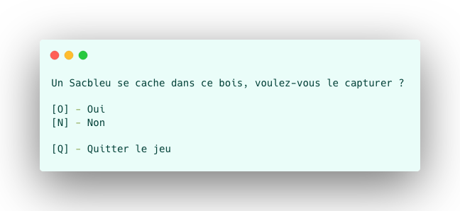
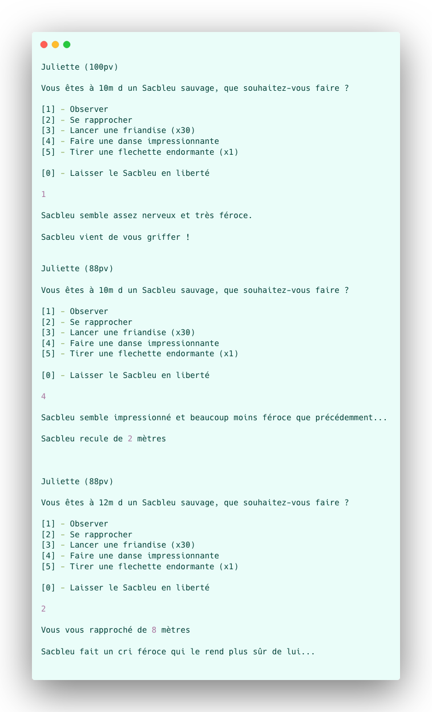

# Madame Juliette et les Ptimos

Bienvenue dans l'Univers de **madame Juliette et les Ptimos**. MJP est un jeu de rôle dans lequel vous incarnez madame Juliette, une scientifique de renom qui étudie des créatures magiques et mystérieuses, les Ptimos...

### But du jeu

Madame Juliette est reconnue comme étant la plus grande spécialiste en Ptimo, cependant trois Ptimos rares lui échappe. Le but du jeu est de les capturer tous !

### Système de jeu

Le jeu se joue en tour par tour et simule une suite de **rencontres** avec des Ptimos. En lançant le jeu, on vous propose de tenter de capturer un Ptimo.

**Exemple d'interface**

Si vous décidez de relever le défi, vous vous retrouvez face à un des Ptimo suivants :

- Sacbleu (rare)
- Pyralia (très rare)
- Pokrand (existe t'il vraiment ?)

Pour capturer un Ptimo il faut **être à moins d'un mètre de lui**, mais chaque rapprochement à tendance à le rendre plus **stressé**.

Par ailleurs, plus le Ptimo est **dominant**, plus il risque de vous **attaquer** !

Afin de faire le bon choix vous devez prendre en compte l'état de stress, le caractère dominant et la distance qui vous sépare du Ptimo.

À la fin d'une rencontre, vous avez le choix d'arrêter le jeu ou de tenter de capturer un autre Ptimo.

**Exemple d'actions**

## Spécifications

### Le jeu

Le jeu s'arrête si vous perdez votre vie ou si vous décidez de refuser une rencontre, il faudra alors recommencer la capture à zéro...

### La rencontre

La rencontre se déroule toujours entre Juliette et un Ptimo.

Cas de fin de rencontre :

- Capture du Ptimo
- Fuite du Ptimo ou de Juliette
- Perte des points de vie de Juliette

Les points de vie sont rechargés à la fin de chaque rencontre.

### Ptimo

Les Ptimos sont des êtres sensibles et vos actions influent leurs sentiments ! Lors de son instanciation, un Ptimo se voit attribué des **points de dominance et de stress** compris entre (50 et 80). Ces deux attributs peuvent atteindre un `maximum de 100 points` pendant la rencontre.

Tous les Ptimos ont quatre actions possibles :

##### Rugir :

*Permet au Ptimo de prendre confiance en lui (augmente les points de dominance et réduit son stress).*

Un Ptimo va avoir tendance à souvent rugir lorsqu'il sent que sa dominance est basse mais que son stress est haut. 
La distance influe aussi : 

- à `moins de 3m` le Ptimo aura tendance à plus souvent attaqué que rugir
- à `plus de 10m` il aura tendance à essayer de s'éloigner 

##### Attaquer :

*Plus un Ptimo est dominant, plus il risque de vous attaquer.*

Un Ptimo va avoir tendance à plus souvent attaquer lorsque sa dominance est haute. Par ailleurs, plus la distance est réduite ou le stress élevé et plus le risque d'attaque magique est grand.

Fréquence de l'attaque en fonction de la dominance : 

- `0-30` (peu fréquent) 
- `31-55` (assez fréquent) 
- `56+` (très fréquent)

##### S'éloigner :

En début de **rencontre** un Ptimo se situe **entre 8m et 15m** de distance. S'il vient à s'éloigner à plus de 15m alors le Ptimo s'enfuit sans que vous puissiez le rattraper.

Plus le Ptimo est stressé et éloigné et plus il aura tendance à s'éloigner d'avantage.
En cas de trop fort stress, le Ptimo se mettra à attaquer plutôt que de fuir. 

Fréquence de l'éloignement en fonction du stress : 
- `0-54` (jamais) 
- `55-74` (peu fréquent) 
- `75-84` (assez fréquent)
- `85+` (jamais - devient très aggressif - augmente le risque d'attaque magique)

##### Attaque magique :

*Cette attaque est différente pour chaque Ptimo, plus vous êtes proche de lui et plus le risque d'attaque magique est grand.* 

Si un Ptimo atteint un score de dominance de `100 points`, cela déclenche automatiquement une attaque magique.

Vous êtes libre d'ajuster les fréquences pour rendre le jeu le plus fun possible !

#### Sacbleu

Le Sacbleu est un Ptimo au tempérament plutôt stressé et pas très dominant. Cependant il exite des exceptions !

L'attaque magique d'un Sacbleu est une **attaque magique commune** càd qu'en plus de frapper plus fort qu'une attaque normale, celle-ci ajoute des points de dominance !

#### Pyralia

Le Pyralia est `deux fois plus rare` qu'un Sacbleu. Celui-ci est nettement moins stressé que le précédent mais beaucoup plus dominant !

L'attaque magique d'un Pyralia est une **attaque magique commune** càd qu'en plus de frapper plus fort qu'une attaque normale, celle-ci ajoute des points de dominance !

#### Pokrand

Une légende dit que le Pokrand est un Ptimo protecteur. Celui-ci viendrait dans le but de libérer les Ptimos que vous avez capturé...

Ainsi, pour rencontrer un Pokrand il faut que vous ayez capturé au moins 5 Ptimos dont un Pyralia minimum !

**Attaque magique**

Pour son attaque magique le Pokrand sort un jeu de cartes et s'en distribue 5 :

Si le combo de cartes est supérieur ou égale à un full (full, carré, quinte flush), le Pokrand vous assomme, libère les Ptimos et fuit !

Si le combo de cartes est supérieur ou égale à un brelan (brelan, quinte ou flush), le Pokrand fuit.

Si le combo est supérieur ou égale à une paire (paire ou double paire), le Pokerand fait une **attaque magique commune**.

Sinon le Pokerand perd 10 points de dominance.

### Juliette

**La seule, l'unique madame Juliette** est une star dans le domaine du comportement des Ptimo ! 

Lors de son instanciation, Juliette se voit attribuée 100 points de vie ainsi que 10 cages à Ptimo pour les stocker !

Juliette a six actions possibles :

##### Observer :

Permet d'en savoir plus sur le Ptimo. Attention vous n'avez que des informations visuelles, **mais à aucun moment un accès directe aux nombres de points de stress ou de dominance du Ptimo**.

Stress perçu : 
- 0-25 (détendu) 
- 26-50 (méfiant) 
- 51-75 (nerveux) 
- 75+ (paniqué)

Dominance perçue : 
- 0-25 (inoffensif) 
- 26-50 (neutre) 
- 51-75 (féroce) 
- 75+ (dangereux)

##### Se rapprocher :

Juliette se rapproche de 3 à 8 mètres (aléatoire). Si la valeur de rapprochement est supérieur ou égale à la distance restante, alors le Ptimo est capturé !

##### Lancer une friandise :

En lancant une friandise vous réduisez le stress du Ptimo. Un lancé de friandise à entre 10 et 70% de chances d'atteindre sa cible en fonction de votre distance. 
Plus vous êtes proche, plus vous visez juste.

Au début du jeu, vous avez 30 friandises, attention à ne pas les gaspiller !

##### Faire une danse impressionnante :

En faisant une danse impressionnante, vous réduisez les points de dominances du Ptimo (de 7 à 21pts de moins).

##### Fléchette endormante :

Une fléchette endormante a **une chance sur deux** d'atteindre sa cible. En cas de réussite, vous capturez le Ptimo ! 
Attention cependant, vous n'avez qu'une fléchette pour tous le jeu !

##### Partir :

Partir peut-être utile en cas de faible points de vie afin d'éviter de perdre tous ses Ptimos...

## Attentes et remarques

Lors de la soutenance vous devrez expliquer votre approche pour réaliser ce jeu !

### Attentes

##### Niveau 1 

Objectifs à atteindre en priorité !

- Avoir un jeu qui fonctionne et être capable d'intéragir avec le joueur
- Prendre en compte les piliers de la POO (encapsulation - héritage - abstraction - polymorphisme)
- Limiter les responsabilités des classes
- Identifier au moins un design pattern utile dans notre jeu
- Commenter les méthodes qui méritent un refacto 

##### Niveau 2

Axes d'améliorations pour avoir un code plus pro ! Ces points seront regardés mais secondaires pour le moment.

- Qualité du code :
  - Nommage
  - Clareté
  - Bonne utilisation de Java

- Limiter les responsabilités des méthodes
- Limiter le nombre de paramètres d'une méthode
- Bonne prise en compte des piliers de la POO
- Code ouvert à l'extension
- Code substituable
- Implémenter au moins un design pattern et expliquer pourquoi
- Faire des choix argumentés (prise de note possible)

##### Niveau 3

Aller plus loin que la consigne (la cerise sur le gâteau) ! Ces points ne seront pas pris en compte pour le moment mais vous entrainent pour la suite !

Exemples :

- GUI
- Tests unitaires
- Versionning
- Outils de qualité du code
...

### Remarques

1°) Pour résoudre ces consignes, vous pouvez vous servir de connaissances autres que celles vue en cours. 

2°) N'hésitez à vous entraider, votre montée en compétences se fait aussi au travers de vos échanges !

3°) Vous pouvez faire des slides explicatifs pour vous accompagner lors de la soutenance

4°) Faites vous plaisir !
